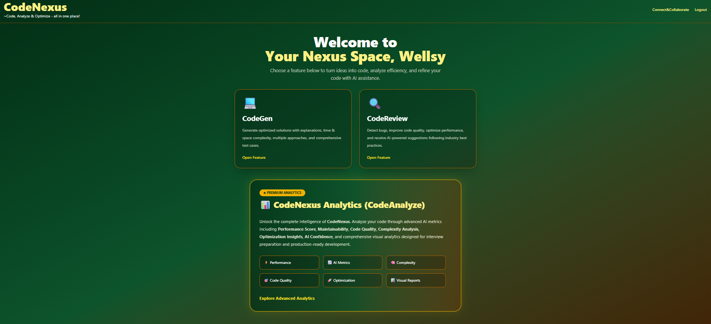
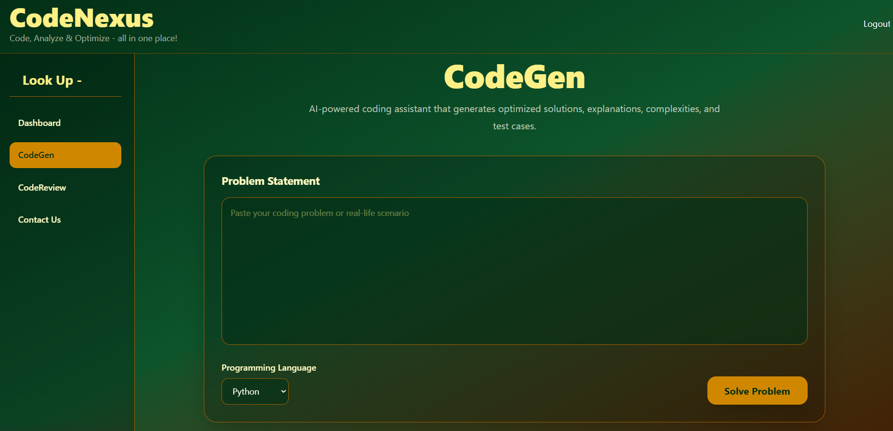
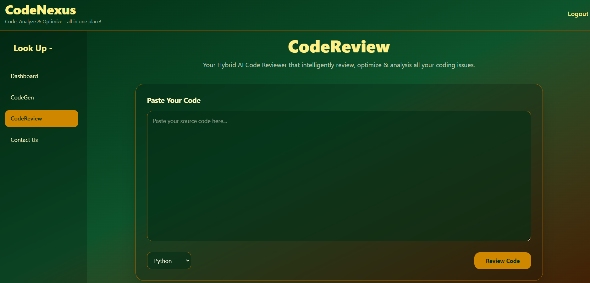

# 🚀 CodeNexus

> AI-powered Competitive Programming Assistant with intelligent code generation, code review, execution, analytics, and Docker support.


---

## 📌 Overview

CodeNexus is an AI-powered coding assistant that helps developers and competitive programmers generate optimized solutions, review code quality, execute programs with custom inputs, and analyze coding performance through an interactive analytics dashboard.

The platform supports multiple programming languages and leverages Google's Gemini AI for intelligent code generation while using MongoDB and Redis for scalable backend operations.

---

# ✨ Features

- 🤖 AI Code Generation
- 🔍 AI Code Review
- ▶️ Execute Code with Custom Input
- 📊 Analytics Dashboard
- ⚡ Performance Insights
- 💾 MongoDB Storage
- 🚀 Redis Caching
- 🐳 Dockerized Deployment
- 🌍 Multi-language Support
- 📈 Response Time Analytics
- 📋 Automatic Test Case Generation

---

# 🛠 Tech Stack

## Frontend

- React
- Vite
- Tailwind CSS

## Backend

- FastAPI
- Python

## Database

- MongoDB

## Cache

- Redis

## AI

- Google Gemini 2.5 Flash

## DevOps

- Docker
- Docker Compose

---

# 📂 Project Structure

```
CodeNexus
│
├── backend
│   ├── app
│   ├── Dockerfile
│   └── ...
│
├── frontend
│   ├── src
│   ├── Dockerfile
│   └── ...
│
├── docker-compose.yml
└── README.md
```

---

# 📸 Screenshots

## 🏠 Home Page


---

## 🔐 Login Page


---

## 📊 Dashboard



---

## 🤖 AI Code Generation



---

## 🔍 AI Code Review



---

## 📈 Analytics Dashboard


---

# 🚀 Getting Started

## Clone Repository

```bash
git clone https://github.com/hasinigolla/CodeNexus.git

cd CodeNexus
```

---

## Docker Setup

```bash
docker compose up --build
```

Frontend

```
http://localhost:5173
```

Backend

```
http://localhost:8000
```

API Docs

```
http://localhost:8000/docs
```

---

# Supported Languages

- Python
- Java
- C++
- C
- JavaScript
- SQL

---

# Upcoming Features

- Voice-based coding assistant
- AI Interview Preparation
- Collaborative Coding
- User Profiles
- Leaderboards
- Code Similarity Detection
- Contest Recommendation System

---

# Author

**Hasini Golla**

Computer Science Engineering Student

Full Stack Developer | AI Enthusiast | Competitive Programmer

GitHub

https://github.com/hasinigolla

---

⭐ If you like this project, consider giving it a Star.