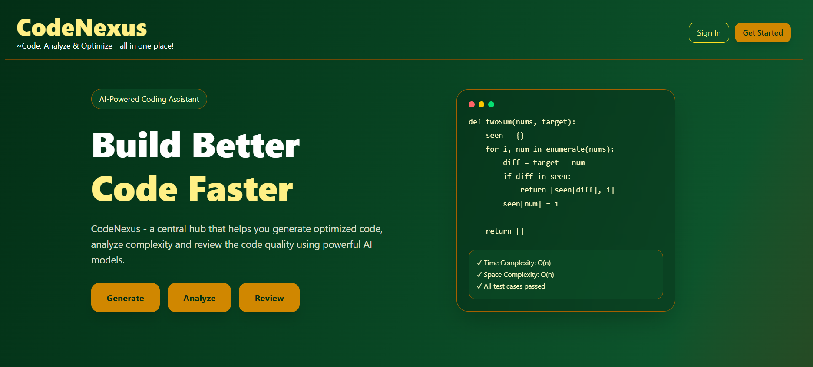
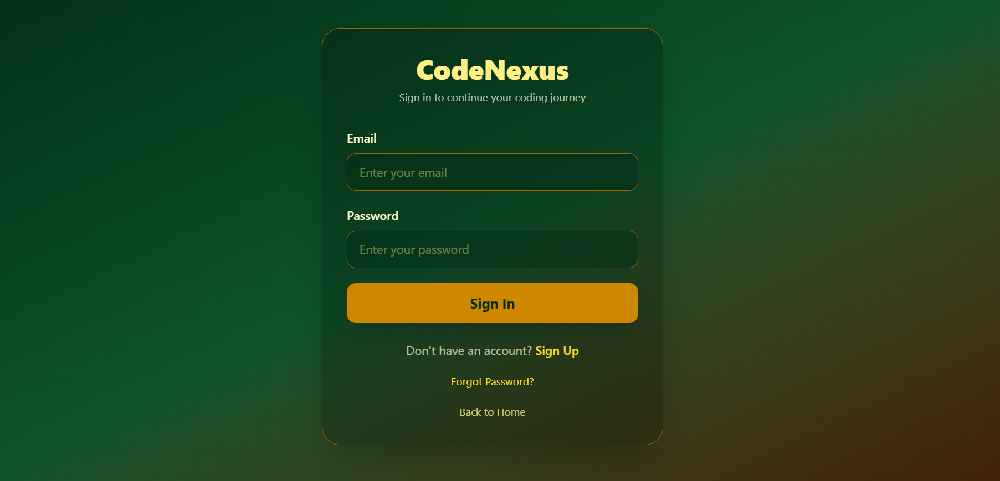
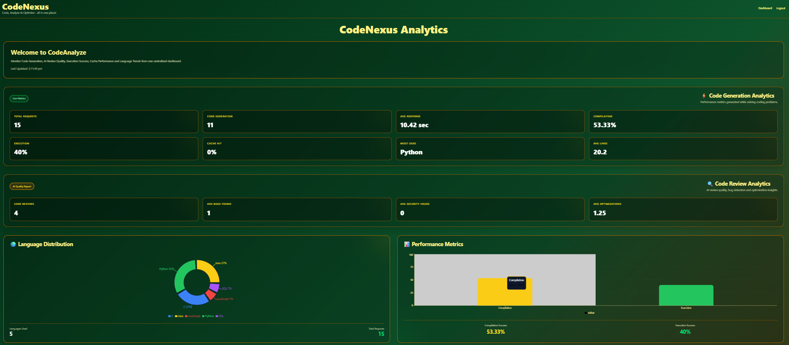

<div align="center">

# 🚀 CodeNexus

### AI-Powered Competitive Programming & Developer Assistant

Generate optimized code, review code quality, execute programs, analyze performance, and accelerate software development using Google's Gemini AI.


⭐ Star this repository if you like the project!

</div>

---

# 📖 Overview

CodeNexus is a full-stack AI-powered coding assistant that helps developers and competitive programmers write better code faster.

It combines modern AI with software engineering tools to generate optimized code, perform intelligent code reviews, execute code with custom inputs, generate test cases, and provide analytics through an interactive dashboard.

Designed with scalability in mind, CodeNexus uses Docker, Redis caching, MongoDB storage, and FastAPI to provide a fast and responsive experience.

---

# ✨ Features

## 🤖 AI Code Generation

- Generate optimized code
- Supports multiple programming languages
- Detailed explanation
- Time Complexity
- Space Complexity
- Automatic Test Cases

---

## 🔍 AI Code Review

- AI-powered code analysis
- Best practice suggestions
- Performance improvements
- Readability analysis
- Optimization recommendations

---

## ▶ Code Execution

- Execute generated code
- Custom user input
- Runtime output
- Error handling
- Compilation support

---

## 📊 Analytics Dashboard

- Request statistics
- Language usage
- Performance metrics
- Response time analytics
- Cache statistics
- AI insights

---

## 🔐 User Authentication

- User Signup
- Login
- Password Reset
- Secure Authentication

---

## ⚡ High Performance

- Redis Caching
- Docker Containers
- FastAPI Backend
- Optimized API calls

---

# 🌍 Supported Programming Languages

- Python
- Java
- C++
- C
- JavaScript
- SQL

---

# 🖼 Application Preview

## 🏠 Home



---

## 🔐 Login



---

## 📊 Dashboard


---

## 🤖 AI Code Generation


---

## 🔍 AI Code Review


---

## 📈 Analytics Dashboard



---

# 🏗 System Architecture

```
                    User
                      │
                      ▼
          React + Vite Frontend
                      │
                      ▼
               FastAPI Backend
                      │
        ┌─────────────┼─────────────┐
        ▼             ▼             ▼
   Gemini AI      MongoDB        Redis
        │             │             │
        └─────────────┴─────────────┘
```

---

# 🛠 Tech Stack

## Frontend

- React
- Vite
- Tailwind CSS
- Axios
- React Router

---

## Backend

- FastAPI
- Python
- Uvicorn
- Pydantic

---

## Artificial Intelligence

- Google Gemini 2.5 Flash

---

## Database

- MongoDB

---

## Cache

- Redis

---

## DevOps

- Docker
- Docker Compose

---

# 📂 Folder Structure

```
CodeNexus
│
├── backend
│   ├── app
│   ├── Dockerfile
│   ├── requirements.txt
│   └── ...
│
├── frontend
│   ├── src
│   ├── public
│   ├── Dockerfile
│   └── ...
│
├── assets
│   └── screenshots
│
├── docker-compose.yml
│
└── README.md
```

---


# 📈 Future Enhancements

- Voice-Based AI Assistant
- AI Interview Preparation
- Real-Time Collaborative Coding
- Contest Recommendation System
- Leaderboards
- AI Debugging Assistant
- Code Similarity Detection
- GitHub Repository Analysis
- AI Resume Builder
- AI Pair Programmer

---

<div align="center">


Made with ❤️ by Hasini Golla

</div>